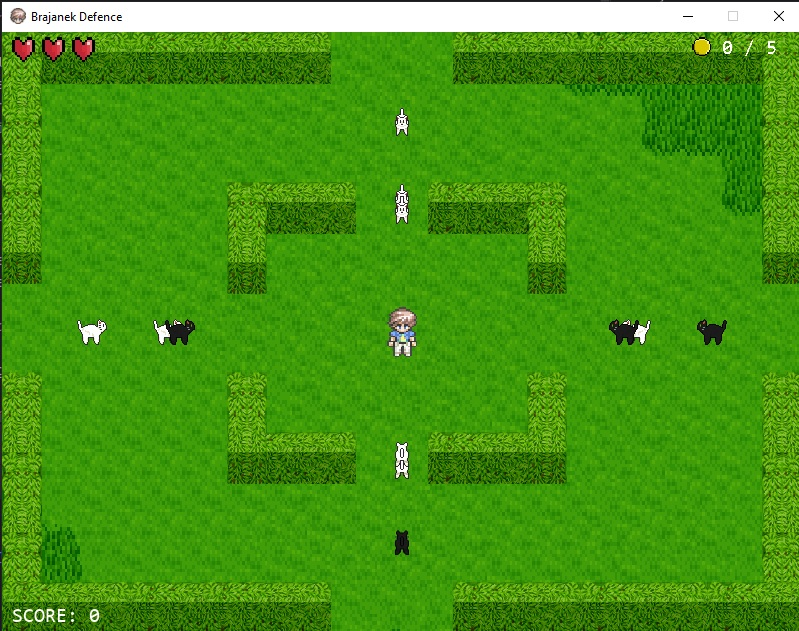

# Brajanek Defence

Brajanek Defence is a simple game developed using the Pygame library. 
The game features a character named Brajanek that can be controlled using keyboard inputs to move in different directions. 
While avoiding obstacles, he has to shoot towards his enemies, a feral cats.
Bring them down and survive the attack!



## Installation

1. Clone the repository or download the source code.
2. Make sure you have Python installed on your system.
3. Install the required dependencies by running the following command:
```pip install pygame```
4. Run the game using the following command:
```python main.py```
5. Enjoy!
## How to Play

- Use the arrow keys or WASD keys to control Brajanek's movement.
- Press the Space key to shoot bullets.
- Press the Escape key to quit the game.

## Gameplay

- The game starts with Brajanek in the middle of the screen.
- Enemies will start spawning from the top, bottom, left and right of the screen and move towards Brajanek.
- Brajanek can shoot bullets towards the enemies by pressing the Space key. It shoots in the direction he is facing
- If an enemy reaches Brajanek, he loses a life. He has 3 lives in total.
- The game ends when Brajanek loses all his lives. Or gets 5 coins that have a chance to drop from enemies.
- Get the highest score possible and survive the attack of feral cats!

## Credits

- Developed by Izabela Pawlukowska and Filip Król
- All assets used in the game are from [OpenGameArt](https://opengameart.org/)

## Documentation

- Documentation can be found in the [PDF](PDF%20DOKUMENTACJA) folder.
- The documentation is in english.
- Rinoh refused cooperation with the project, so the documentation is in PDF format made from LaTeX auto generated file.
- The documentation is not complete, but it contains all the necessary information to the inner workings of the game, not how the game runs line by line that would be awful.
- Main file of the documentation is [documentacja.pdf](PDF%20DOKUMENTACJA/documentacja.pdf)
- Backup file of the documentation is [index.pdf](PDF%20DOKUMENTACJA/index.pdf)


