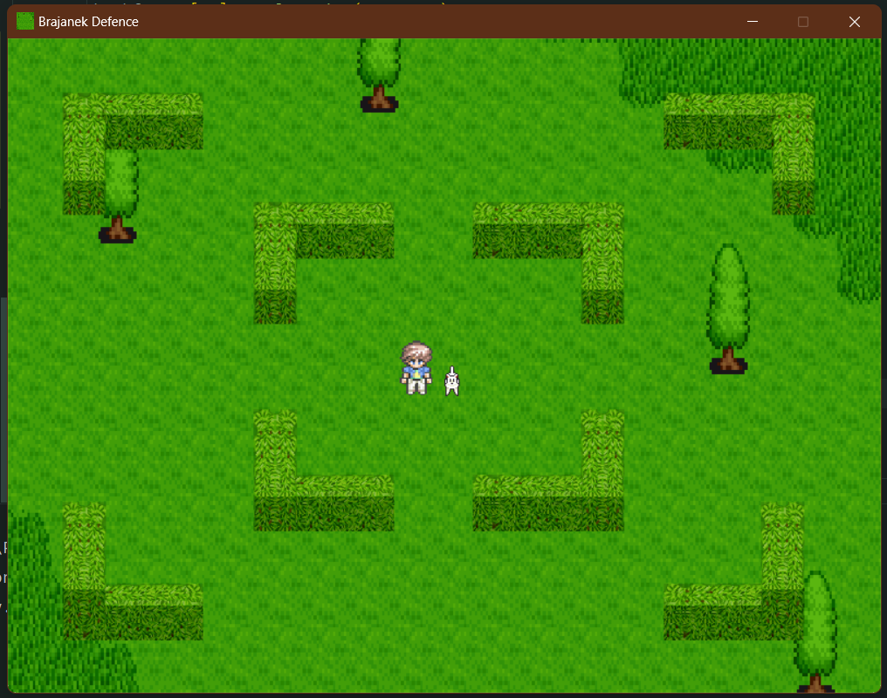

# Brajanek Defence

Brajanek Defence is a simple developed using the Pygame library. The game features a character named Brajanek that can be controlled using keyboard inputs to move in different directions. Avoiding obstacles, he has to shoot towards his enemies.



## Installation

1. Clone the repository or download the source code.
2. Make sure you have Python installed on your system.
3. Install the required dependencies by running the following command:
```pip install pygame```
4. Run the game using the following command:
```python main.py```
5. 
## How to Play

- Use the arrow keys or WASD keys to control Brajanek's movement.
- Press the Escape key to quit the game.

## Gameplay

The game window displays a background image where Brajanek moves according to the player's input. Brajanek changes its image based on the movement direction (right, left, up, or down). The game runs at a frame rate of 60 FPS.

## Credits

- Developed by Filip Król and Izabela Pawlukowska
- Background image source: [Background Image Source Link]
- Icon image source: [Icon Image Source Link]

## License

[License information if applicable]
